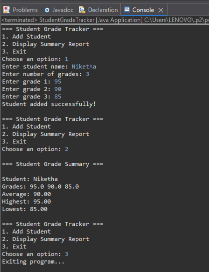

# 🎓 Student Grade Tracker

The **Student Grade Tracker** is a simple Java-based console application designed to help students, teachers, or institutions keep track of academic performance across multiple subjects or assignments. It enables users to input multiple grades for each student and provides useful analytical insights like average, highest, and lowest grades.

---

## 💡 Project Concept

This project focuses on building a **basic yet effective academic performance management system**. It aims to:

- **Record student grades**: Users can input the name of a student along with any number of grades.
- **Ensure data accuracy**: Grades are validated to ensure they fall within the 0–100 range.
- **Analyze performance**: The application calculates and displays the average, highest, and lowest scores for each student.
- **Encourage structured data input** through an interactive menu-driven interface.

This tool mimics a **lightweight gradebook**, and is especially useful for:

- Practicing basic Java programming constructs such as:
  - Classes & Objects
  - Arrays
  - Loops and conditionals
  - User input handling with `Scanner`
  - Menu-driven design
- Understanding the fundamentals of data validation and basic statistics

---

## 🧠 Key Functionalities

| Feature                     | Description                                                       |
|----------------------------|------------------------------------------------------------------- |
| Add Student                | Allows the user to enter a student's name and multiple grades      |
| Grade Validation           | Ensures each grade is between 0 and 100                            |
| Calculate Average          | Computes the mean score for each student                           |
| Get Highest and Lowest     | Identifies the highest and lowest grade from the list              |
| Display Summary Report     | Outputs a clear report of grades and statistics for each student   |

---

## 📌 Use Cases

- Personal academic tracking
- Mini project for Java programming practice
- Small-scale student grade analysis system
- Classroom demonstration of object-oriented programming concepts

---

## 📸 Output Example

---

## 📚 Learning Objectives

Through this project, learners can:

- Apply **Object-Oriented Programming (OOP)** principles
- Understand **array handling** and **input validation**
- Create interactive command-line applications
- Practice **data summarization techniques**

